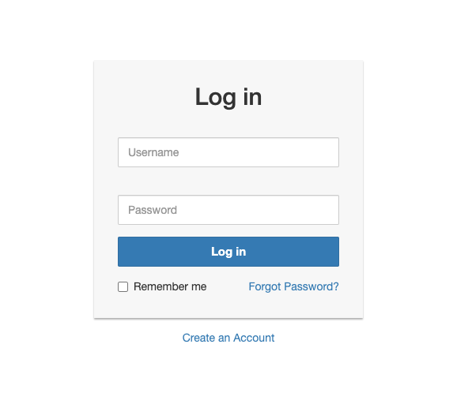
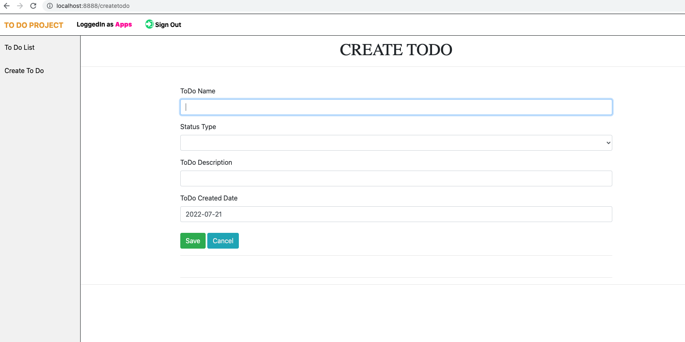
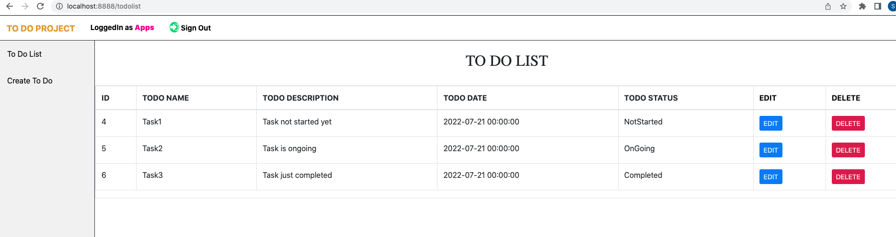
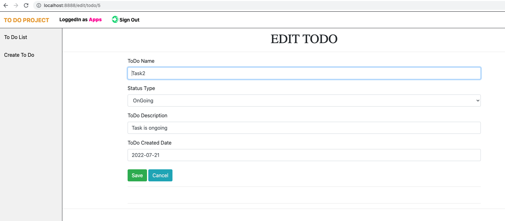
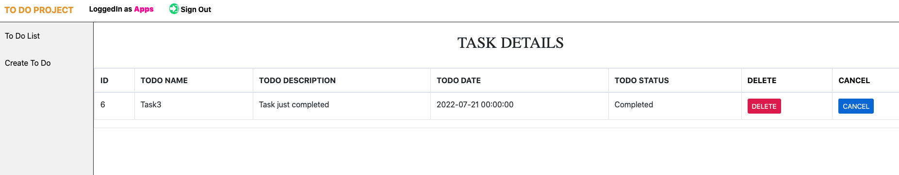

# ToDoProject
Todo project for Integrify.

## Technology Used

## Programming Language

Python

## Framework

Flask

## Database

PostgreSQL

I have used a condo environment to develop a ToDo application instead of virtualenv. The Conda environment is much smoother than virtualenv and supports most of the dependency itself. To be able to run the project there are some required dependencies that should be installed in your env and in the system.

#### 1. Install PostgreSQL on Mac( I am using version 10)
#### 2.Install SQLAlchemy
#### 3.Install psycopg2 inside the env
#### 4.Install Flask-bootstrap
#### 5.Flask and rest of the dependency 

### The To Do app features Include:

#### Create Database name ToDo_Details in PostgreSQL 10

#### User Login/Create New User

Create ToDo task

Display task

Edit todo task

Delete Task

Delete Confirm

